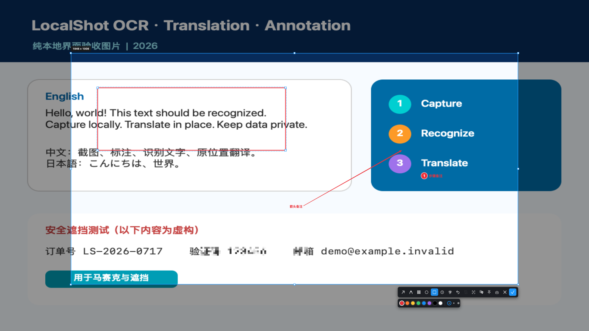
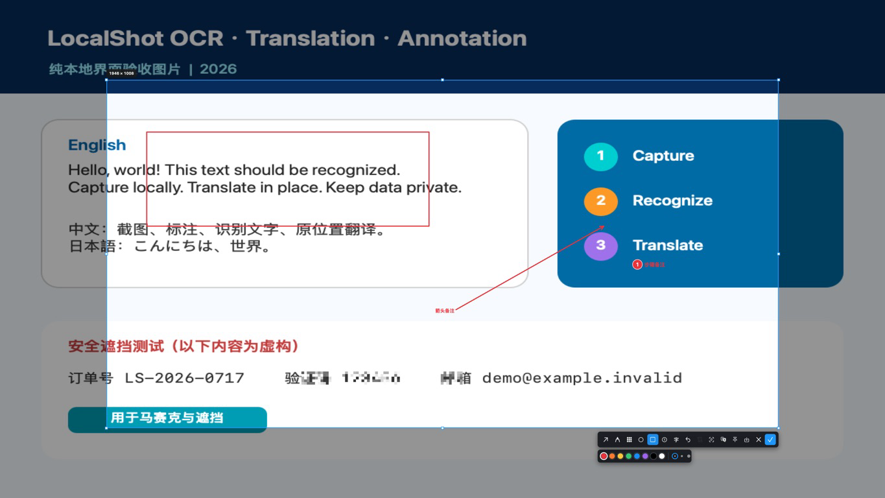
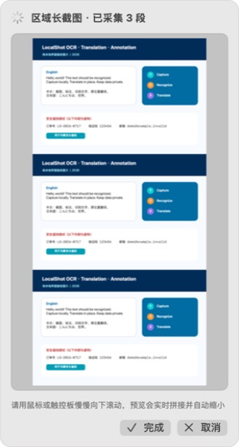
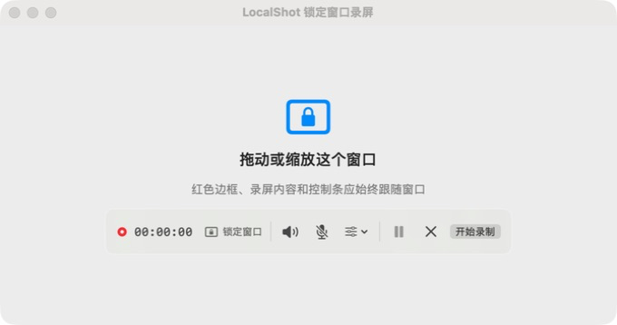
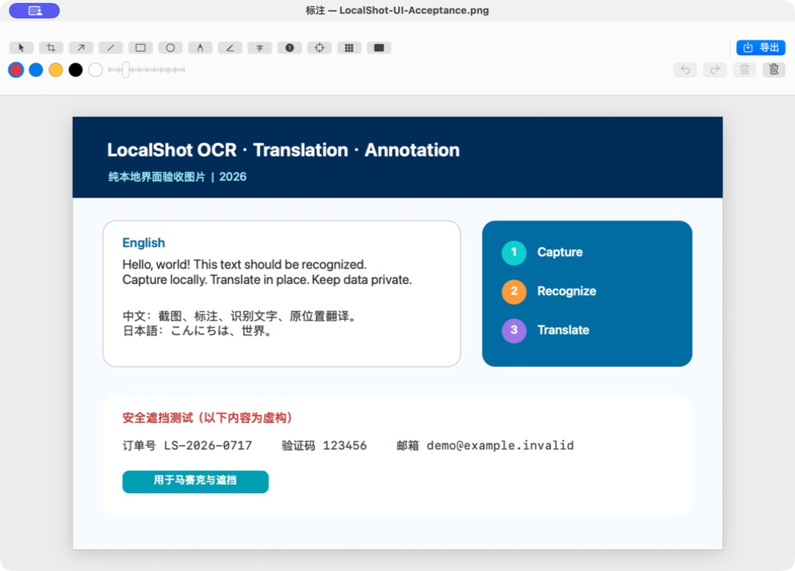

# LocalShot

一款面向 macOS、截图和录屏内容都在本机处理的工具：完成区域、窗口、全屏、区域长截图和区域屏幕录制，并在本机进行标注、OCR、原位置翻译、置顶、美化和历史搜索。

LocalShot 不包含账号、云同步、广告或在线存储。截图、录屏和识别内容不会上传；直接分发版只会访问公开 GitHub Release 检查和下载软件更新。

## 下载

当前公开测试版：**0.3.1（Build 15）**

[前往 GitHub Releases 下载 LocalShot](https://github.com/tpxcer/LocalShot-Downloads/releases/tag/v0.3.1-build15)

下载文件：`LocalShot-0.3.1-build15-offline-license-universal2-arm64-x86_64.dmg`

> 当前版本同时支持 Apple 芯片和 Intel Mac，最低需要 macOS 13。安装包尚未经过 Apple 公证，首次打开时需要按照[安装说明](INSTALL.md)完成系统确认。

> Build 4 及更早版本没有更新检查功能，需要手动安装 Build 15；Build 5–14 用户可直接在软件内收到 Build 15 更新提示。

## 软件截图

### 快捷截图与即时标注

进入区域截图时使用与系统默认指针同尺寸的彩虹箭头光标，并提供扩大后的方形像素放大镜。拖选区域后，液态玻璃工具栏可直接添加箭身与实心三角头整体放大约 25% 的标注箭头，以及步骤、文字、矩形、马赛克或模糊；完成后可复制、另存、OCR、翻译或置顶。



### 区域长截图

先框定窗口中的具体区域，再进入长截图模式。采集时由用户使用鼠标滚轮或触控板滚动，选区边框持续显示，预览窗口会实时展示并自动缩小当前拼接结果。



长截图进行过程中，独立预览窗口会显示已采集段数和当前拼接结果。随着图片变长，预览会自动缩小，用户可随时选择完成或取消。



### 区域屏幕录制

在 macOS 15 或更高版本中选择需要录制的窗口或屏幕区域。单击自动识别的窗口会锁定该窗口，移动或缩放窗口时录制内容、红框和控制条会跟随；拖动自由框选则固定在屏幕位置。开始前显示 3、2、1 倒计时；录制中可暂停/继续，也可使用全局 `⌘⇧R` 停止。画质支持标准、高清和原画，帧率支持 30/60 FPS，并显示预计文件增长和磁盘可用空间。完成后视频以 H.264 MP4 保存在本机独立录制目录。



红色范围框在录制结束前保持置顶；控制条集中显示锁定模式、系统声音、麦克风、画质与帧率、暂停和开始/停止操作。截图使用 LocalShot 自带的虚构验收窗口，不包含真实录制内容。

### 完整标注编辑器

已有图片也可以导入标注编辑器，继续添加箭头、文字、步骤、形状、聚光灯、马赛克和安全遮挡，并支持裁剪、撤销、重做和导出。



截图中的页面、订单号、邮箱和标注均为虚构演示内容。

## 主要功能

### 多种截图方式

- 区域截图：自由框选，支持移动选区和八个方向调整边框。
- 窗口截图：自动识别并高亮当前窗口。
- 全屏截图：捕获当前显示器画面。
- 区域长截图：只拼接窗口内选定区域，不把标题栏、地址栏或选区外桌面带入结果。
- 区域录屏：自动识别并锁定窗口，或自由框选固定屏幕区域；持续显示红框和计时，支持倒计时、暂停/继续、全局停止、系统声音与麦克风。

### 截图浮层标注

- 箭身、箭尾和大实心三角头统一加粗放大的箭头，以及画笔、文字、步骤编号、椭圆和直角矩形。
- 截图工具栏和下级属性面板使用局部模糊液态玻璃样式，浅色与深色画面上都保持图标对比度。
- 马赛克与模糊分级调节；模糊会保留内容底色，同时隐藏文字和细节。
- 颜色、粗细和样式调整，支持撤销。
- 已添加的箭头、步骤和图形可再次选中、编辑或删除。
- 截图选区、标注和窗口选择阶段均可用鼠标右键立即取消；Delete/Backspace 用于删除选中的标注。
- 扩大后的方形像素放大镜、十字准星、尺寸提示和光标位置十六进制颜色。

### 手动区域长截图

1. 框选需要持续滚动的窗口区域。
2. 点击工具栏中的长截图按钮。
3. 使用鼠标滚轮或触控板慢慢向下滚动。
4. 在实时预览中确认拼接进度，完成后主动结束采集。

LocalShot 会根据相邻画面重叠部分进行本地拼接，并尽量去除重复的固定标题栏或底部区域。当前测试版单次最多处理 30 段，以避免失控采集或保存不完整结果。

### 本地区域录屏

1. 从菜单选择“区域录屏”，或在截图选区工具栏点击圆形录制图标。
2. 单击自动识别的窗口进入锁定跟随录制，或拖动自由框选固定屏幕区域。
3. 按需选择系统声音、麦克风、标准/高清/原画与 30/60 FPS，然后点击“开始录制”。
4. 录制中可暂停/继续；点击红色“停止录制”或按全局 `⌘⇧R` 完成保存，LocalShot 会在 Finder 中定位 MP4。

控制条会按当前画质与帧率显示每分钟文件大小估算范围和磁盘可用空间。空间达到安全线时，LocalShot 会自动停止并保存已有内容。录制文件保存在 `Application Support/LocalShot/Recordings`，不进入截图历史，也不会被“清空截图记录”删除。区域录屏需要 **macOS 15 或更高版本**。

### OCR 与原位置翻译

- 使用 macOS Vision 在本机识别图片文字。
- 截图工具栏点击“识别文字”后，可在原截图选区内再次框选真正需要识别的文字范围。
- 全局快捷键 `⌘⇧O` 可跳过普通截图工具栏，直接框选屏幕文字并打开识别结果。
- 二次文字框选可用鼠标右键或 Escape 取消。
- OCR 结果可逐项或全部复制，并用于本地历史搜索。
- 使用 macOS Apple Translation 将译文覆盖到原图片对应位置。
- 支持查看原文、复制单块译文和导出翻译后的图片。

原位置系统翻译需要 **macOS 15 或更高版本**，并需要 macOS 已安装对应语言资源。语言资源由系统管理，LocalShot 不提供或运营翻译服务器。

### 图片编辑与整理

- 导入本地图片继续标注、裁剪、移动、缩放和旋转。
- 截图置顶，可调缩放、透明度和鼠标穿透。
- 图片美化支持背景、边距、圆角、阴影和画布比例。
- 本地截图历史支持按文件名、日期、OCR 内容和截图类型搜索。
- 支持 PNG/JPEG、自定义文件名前缀、保存目录、是否包含光标和窗口阴影。
- 支持自定义快捷键，以及由用户选择是否登录时自动启动。

### 新版本检查与下载

- 自动检查默认开启，每 24 小时最多查询一次公开 GitHub Release，可在设置中关闭。
- 设置页保留“检查更新”按钮，可随时手动查询。
- 发现新版时只显示提示，不会在后台静默下载安装包。
- 用户确认后才下载 DMG；文件大小和 GitHub SHA-256 digest 校验通过后，才保存到“下载”文件夹并自动打开。
- 打开 DMG 后仍由用户把新版拖入“应用程序”覆盖旧版，LocalShot 不会自行替换正在运行的应用。

## 离线永久授权

LocalShot 使用一机一码的永久离线授权，不需要注册账号，也不连接授权服务器。

1. 安装并打开 LocalShot。
2. 在设置的“软件授权”中复制机器码。
3. 将机器码发送给向你提供软件的销售方。
4. 把收到的授权码粘贴回软件并激活。

授权码与生成时的 Mac 绑定，不能直接用于另一台电脑。LocalShot 不会自动上传机器码、授权码或原始硬件标识。

请勿在公开 Issue 中发布机器码或授权码。

## 系统要求

| 项目 | 要求 |
| --- | --- |
| 处理器 | Apple 芯片（arm64）或 Intel（x86_64）Mac |
| 系统 | macOS 13 或更高版本 |
| 原位置翻译 | macOS 15 或更高版本 |
| 区域屏幕录制 | macOS 15 或更高版本 |
| 屏幕捕获权限 | 首次截图或录屏时按 macOS 提示允许 |
| 麦克风权限 | 仅在用户主动开启录屏麦克风时需要 |
| 辅助功能权限 | 当前手动滚动长截图不需要 |
| 网络 | 截图和授权无需联网；版本检查与下载访问 GitHub，可关闭自动检查 |

Build 15 使用同一个 Universal 2 安装包覆盖两种处理器架构，不需要区分下载版本。

## 安装与首次使用

1. 从 [Build 15 Release](https://github.com/tpxcer/LocalShot-Downloads/releases/tag/v0.3.1-build15) 下载 DMG。
2. 打开 DMG，将 `LocalShot.app` 拖入“应用程序”文件夹。
3. 在“应用程序”中打开 LocalShot。
4. 如果 macOS 阻止启动，请进入“系统设置 → 隐私与安全性”，在对应提示旁选择“仍要打开”。
5. 第一次截图时，按照系统提示允许 LocalShot 使用屏幕捕获权限，然后重新打开软件。

完整步骤和常见提示见[安装说明](INSTALL.md)。

## 校验下载文件

Release 同时提供 SHA-256 校验文件。把 DMG 和校验文件下载到同一目录后，可在终端运行：

```bash
shasum -a 256 -c SHA256SUMS-v0.3.1-build15-public.txt
```

看到 `OK` 表示下载文件与发布版本一致。

## 本地隐私

- 截图、区域录屏、录制声音、导入图片、OCR、翻译结果、标注项目和历史记录都保存在本机。
- 不包含分析统计、用户行为追踪、广告标识符或远程崩溃日志上传。
- 只有用户主动复制、导出或发送时，内容才会离开 LocalShot。
- 自动更新检查只查询公开 GitHub Release，不发送截图、录屏、声音、OCR、机器码、授权码、历史或文件路径；可在设置中关闭。
- 系统翻译语言资源可能由 macOS 从 Apple 下载，这一过程由操作系统管理。

详细边界见[隐私说明](PRIVACY.md)。

## 当前版本说明

- 这是公开测试版，安装包尚未经过 Apple Developer ID 公证。
- 同一 Universal 2 安装包支持 Apple 芯片与 Intel Mac。
- 提供区域和锁定窗口 MP4 录制，不提供 GIF 或整屏视频录制，也不提供云端分享、团队协作或跨设备同步。
- 长截图需要用户手动滚动；复杂动画、不断变化的页面或重叠不足的内容可能影响拼接效果。
- 系统翻译能力、支持语言和语言资源下载状态取决于当前 macOS。

## 问题反馈

如遇到安装、截图、录屏、拼接或授权问题，请提交 [GitHub Issue](https://github.com/tpxcer/LocalShot-Downloads/issues)。

反馈时可以提供 macOS 版本、Mac 芯片型号、LocalShot 版本和可公开的复现步骤。请不要附带授权码、机器码、私人截图、个人文件路径或其他敏感信息。

本仓库仅用于发布客户安装包和公开说明，不开放 LocalShot 源代码。
